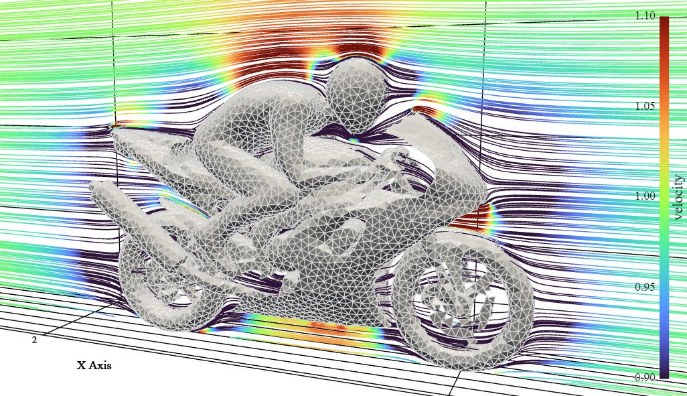
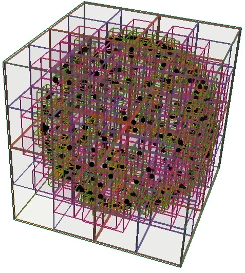

<h1 align='center'>Vortax 🌬️🌪️🍃</h1>

> **NOTE: this library is currently a heavy work in progress - expect breaking changes. Currently, this repo is in a state that may be of interest to aerodynamics researchers, but it's not yet packaged/versioned/tested with the intent of supporting end-users.**

Vortax is a [JAX](https://github.com/jax-ml/jax) library for boundary-element representations of flowfields for fluid dynamics problems, where kernels may be potential flow singularities or otherwise.

Features:

- **Hardware-accelerated**: Leverages JAX to run parts of the solve (e.g., kernel computations, linear- and least-squares solves) on GPUs.
- **Scalable**: Uses matrix-free methods and hierarchical spatial decompositions to improve runtime for large problems. (WIP)
- **Differentiable**: Differentiable with respect to a) geometry, b) freestream conditions, and c) kernel functions.
- **Mesh-compatible**: Takes raw unstructured triangulated surface meshes (e.g., STL files) as input, allowing easy application to complex geometries.

## Gallery

[Interactive motorbike demo](https://peterdsharpe.github.io/Vortax/motorbike_scene.html):

[](https://peterdsharpe.github.io/Vortax/motorbike_scene.html)

Octree decomposition for hierarchical acceleration:



## Installation

For a platform-agnostic source installation, requiring Python 3.10+:

```bash
pip install -e .
```

By default, this will pull the CPU-only version of `jax` and `jaxlib`, which is compatible with Linux/MacOS/WSL/Windows. To use a GPU, [install `jax` and `jaxlib` with GPU support](https://docs.jax.dev/en/latest/installation.html). On Linux/MacOS/WSL, you can do this with `pip install -U "jax[cuda12]"`, assuming you have CUDA 12 installed (`nvidia-smi` to check).
